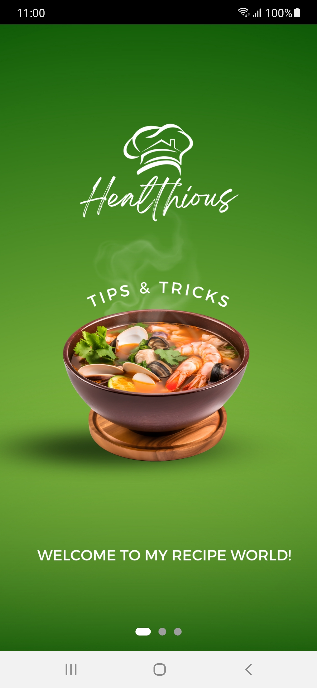
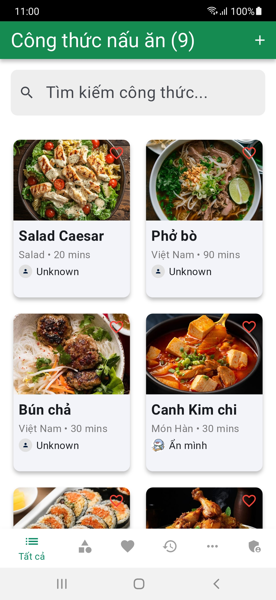
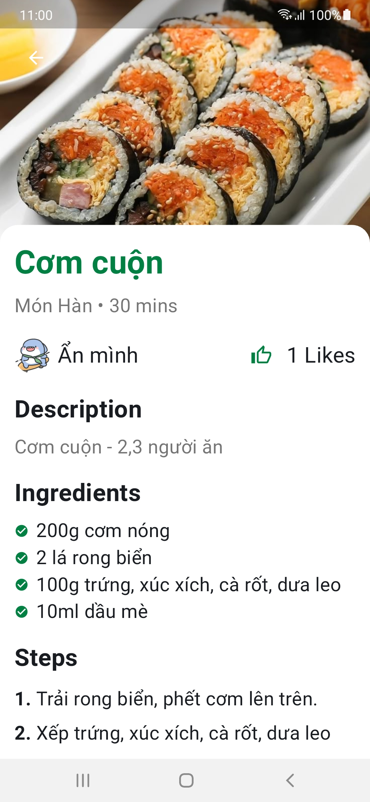

# Project học phần PTUD Di động (CT484)

Học kỳ 2, Năm học 2024-2025

**Tên dự án**:
Xây dựng app đọc công thức nấu ăn
**MSSV 1**: 
B2105548
**Họ tên SV 1**:
Nguyễn Phú Lâm
**MSSV 2**:
B2111789
**Họ tên SV 2**:
Phan Trần Thảo Duy
**Lớp học phần**:
CT48401
## Mô tả dự án
Dự án này là một ứng dụng di động giúp người dùng tra cứu và đọc và đóng góp các công thức nấu ăn một cách dễ dàng 🚀.

## Link demo dự án
https://youtu.be/azW1M0HgQFQ?si=mIvmHrN_-Ud9SYtd

## Giao diện ứng dụng
Dưới đây là một số hình ảnh minh họa giao diện của ứng dụng:

<table>
  <tr>
    <td align="center">
      
       Trang onboarding
    </td>
    <td align="center">
      
       Danh sách công thức
    </td>
    <td align="center">
      
       Chi tiết công thức
    </td>
  </tr>
</table>
"# FoodRecipe" 
